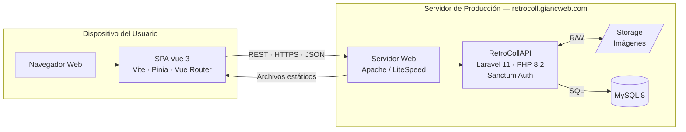

# 🎮 RetroColl — Marketplace de Videojuegos Retro

> **Trabajo de Fin de Grado — Desarrollo de Aplicaciones Web (DAW)**  
> 2º Curso · Grado Superior · 2025–2026

---

## 📋 Descripción del Proyecto

**RetroColl** es una aplicación web fullstack que funciona como un **marketplace de compraventa de videojuegos y consolas retro**. Los usuarios pueden publicar artículos para vender, buscar productos por categoría o plataforma, añadirlos al carrito y realizar compras. El sistema incluye además un panel de administración y un sistema de valoraciones entre usuarios.

El proyecto ha sido desarrollado como **Proyecto Intermodular** del ciclo formativo de Grado Superior en Desarrollo de Aplicaciones Web, integrando los conocimientos adquiridos a lo largo de los dos cursos.

---

## 🎯 Objetivos

- Desarrollar una aplicación web completa con arquitectura **cliente-servidor separada**.
- Aplicar el patrón **SPA (Single Page Application)** en el frontend.
- Implementar una **API REST** segura con autenticación basada en tokens.
- Desplegar la aplicación en un entorno de producción real.

---

## 🏗️ Arquitectura

El proyecto está dividido en dos partes independientes que se comunican a través de una API REST:

```
RetroColl/
├── Laravel/
│   └── RetroCollAPI/      → Backend: API REST (Laravel 11 + PHP 8.2)
└── Vue/                   → Frontend: SPA (Vue 3 + Vite)
```

### Diagrama de despliegue



---

## 🛠️ Tecnologías Utilizadas

### Backend
| Tecnología | Versión | Uso |
|---|---|---|
| PHP | 8.2 | Lenguaje del servidor |
| Laravel | 11 | Framework MVC / API REST |
| Laravel Sanctum | 4.0 | Autenticación por tokens |
| MySQL | 8.x | Base de datos relacional |
| Composer | 2.x | Gestión de dependencias PHP |

### Frontend
| Tecnología | Versión | Uso |
|---|---|---|
| Vue.js | 3 | Framework SPA |
| Vite | 5.x | Bundler y servidor de desarrollo |
| Pinia | 2.x | Gestión de estado global |
| Vue Router | 4.x | Enrutamiento cliente |

### Despliegue
| Servicio | Uso |
|---|---|
| Hostinger | Servidor de producción (Linux) |
| Apache / LiteSpeed | Servidor web |
| FileZilla | Transferencia de archivos |
| SSH | Administración remota del servidor |

---

## 🗄️ Modelo de Datos

La base de datos está compuesta por **6 tablas principales**:

| Tabla | Descripción |
|---|---|
| `USUARIO` | Usuarios registrados (compradores y vendedores) |
| `PRODUCTO` | Artículos publicados en el marketplace |
| `CATEGORIA` | Categorías de productos (consola, juego, accesorio…) |
| `PLATAFORMA` | Plataformas de videojuegos (PS2, SNES, GameBoy…) |
| `COMPRA` | Registro de transacciones realizadas |
| `VALORACION` | Valoraciones entre usuarios tras una compra |

---

## 🔌 Endpoints de la API

### Rutas públicas (sin autenticación)
| Método | Endpoint | Descripción |
|---|---|---|
| `POST` | `/api/registrar` | Registro de nuevo usuario |
| `POST` | `/api/login` | Inicio de sesión |
| `GET` | `/api/productos` | Listado de productos |
| `GET` | `/api/productos/{id}` | Detalle de un producto |
| `GET` | `/api/categorias` | Listado de categorías |
| `GET` | `/api/plataformas` | Listado de plataformas |
| `GET` | `/api/usuarios/{id}/valoraciones` | Valoraciones de un usuario |

### Rutas protegidas (requieren token Sanctum)
| Método | Endpoint | Descripción |
|---|---|---|
| `POST` | `/api/logout` | Cierre de sesión |
| `PUT` | `/api/perfil` | Actualizar perfil del usuario |
| `POST` | `/api/productos` | Publicar un nuevo producto |
| `PUT` | `/api/productos/{id}` | Editar un producto propio |
| `DELETE` | `/api/productos/{id}` | Eliminar un producto propio |
| `POST` | `/api/compras` | Realizar una compra |
| `GET` | `/api/compras/mis-compras` | Ver historial de compras |
| `POST` | `/api/valoraciones` | Valorar a un vendedor |

### Rutas de administrador
| Método | Endpoint | Descripción |
|---|---|---|
| `GET` | `/api/admin/estadisticas` | Estadísticas generales |
| `GET` | `/api/admin/usuarios` | Listado de todos los usuarios |
| `PUT` | `/api/admin/usuarios/{id}/rol` | Cambiar rol de un usuario |
| `DELETE` | `/api/admin/usuarios/{id}` | Eliminar un usuario |
| `GET` | `/api/admin/productos` | Listado de todos los productos |
| `DELETE` | `/api/admin/productos/{id}` | Eliminar cualquier producto |

---

## 🖥️ Vistas del Frontend

| Vista | Descripción |
|---|---|
| `VistaInicio` | Página principal con productos destacados |
| `VistaProductos` | Catálogo con filtros por categoría y plataforma |
| `VistaProductoDetalle` | Detalle de un producto individual |
| `VistaCategorias` | Navegación por categorías |
| `VistaLogin` / `VistaRegistro` | Autenticación de usuarios |
| `VistaPerfil` | Perfil público con productos y valoraciones |
| `VistaEditarPerfil` | Edición de datos del usuario |
| `VistaVenta` | Formulario para publicar o editar un producto |
| `VistaCheckout` | Proceso de compra con carrito |
| `VistaDashboard` | Panel de administración |
| `VistaAyuda` | Preguntas frecuentes y soporte |
| `Vista404` | Página de error 404 |

---

## 🚀 Instalación en Local

### Requisitos previos
- PHP 8.2+
- Composer
- Node.js 18+ y npm
- MySQL
- XAMPP (recomendado en Windows)

### 1. Clonar el repositorio

```bash
git clone https://github.com/Lianji10/RetroColl-.git
cd RetroColl
```

### 2. Configurar el Backend (Laravel)

```bash
cd Laravel/RetroCollAPI

# Instalar dependencias PHP
composer install

# Copiar el archivo de entorno
cp .env.example .env     # (ajustar los datos de BD)

# Generar clave de aplicación
php artisan key:generate

# Ejecutar migraciones y seeders
php artisan migrate --seed

# Crear enlace de storage
php artisan storage:link

# Iniciar el servidor de desarrollo
php artisan serve
```

La API quedará disponible en `http://localhost:8000`

### 3. Configurar el Frontend (Vue)

```bash
cd Vue

# Instalar dependencias
npm install

# Iniciar el servidor de desarrollo
npm run dev
```

La aplicación quedará disponible en `http://localhost:5173`

---

## ☁️ Despliegue en Producción

El proyecto está desplegado en **Hostinger** bajo el dominio:  
🌐 **[https://retrocoll.giancweb.com](https://retrocoll.giancweb.com)**

El proceso de despliegue está automatizado mediante el script `deploy.sh` incluido en el backend:

```bash
# Desde el servidor via SSH
bash deploy.sh
```

Este script se encarga de instalar dependencias, copiar el `.env` de producción, ejecutar migraciones, cachear la configuración y establecer los permisos correctos.

---

## 👤 Autor

**Gian Carlos** — Estudiante de 2º DAW  
Proyecto Intermodular · Grado Superior Desarrollo de Aplicaciones Web  
Curso 2025–2026
